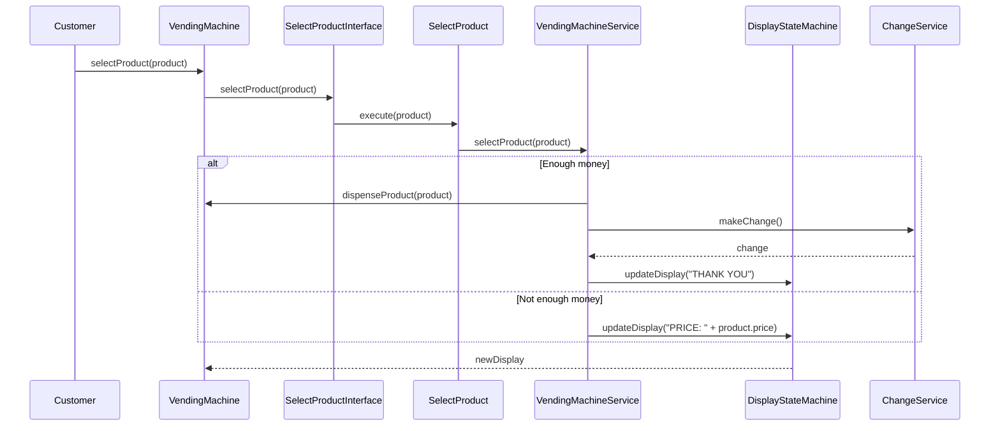

# Use Case: Select Product

```mermaid
sequenceDiagram
    participant Customer
    participant VendingMachine
    participant SelectProductInterface
    participant SelectProduct
    participant VendingMachineService
    participant DisplayStateMachine
    participant ChangeService

    Customer->>VendingMachine: selectProduct(product)
    VendingMachine->>SelectProductInterface: selectProduct(product)
    SelectProductInterface->>SelectProduct: execute(product)
    SelectProduct->>VendingMachineService: selectProduct(product)
    alt Enough money
        VendingMachineService->>VendingMachine: dispenseProduct(product)
        VendingMachineService->>ChangeService: makeChange()
        ChangeService-->>VendingMachineService: change
        VendingMachineService->>DisplayStateMachine: updateDisplay("THANK YOU")
    else Not enough money
        VendingMachineService->>DisplayStateMachine: updateDisplay("PRICE: " + product.price)
    end
    DisplayStateMachine-->>VendingMachine: newDisplay
```
