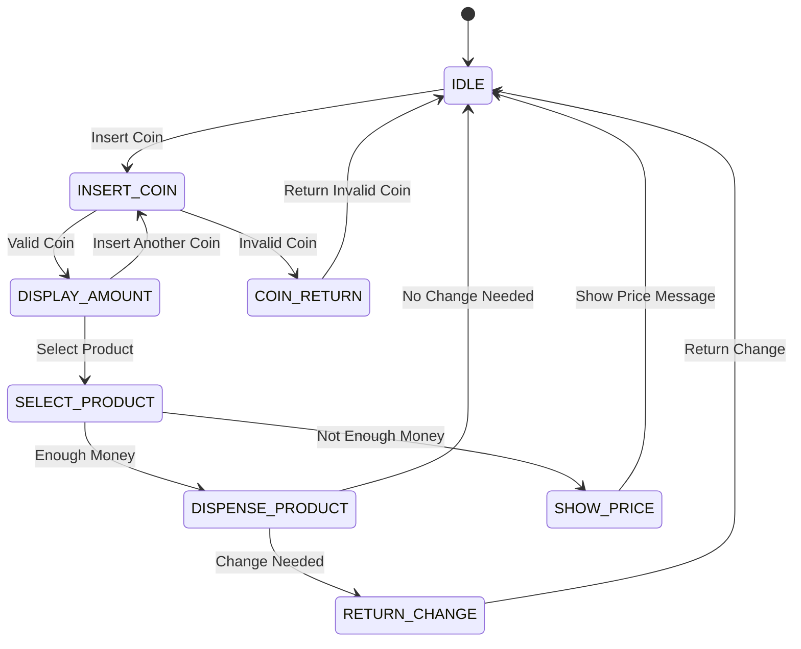

# Vending machine state diagram

```mermaid
stateDiagram-v2
    [*] --> IDLE
    IDLE --> INSERT_COIN : Insert Coin
    INSERT_COIN --> DISPLAY_AMOUNT : Valid Coin
    INSERT_COIN --> COIN_RETURN : Invalid Coin
    DISPLAY_AMOUNT --> INSERT_COIN : Insert Another Coin
    DISPLAY_AMOUNT --> SELECT_PRODUCT : Select Product
    SELECT_PRODUCT --> DISPENSE_PRODUCT : Enough Money
    SELECT_PRODUCT --> SHOW_PRICE : Not Enough Money
    DISPENSE_PRODUCT --> RETURN_CHANGE : Change Needed
    DISPENSE_PRODUCT --> IDLE : No Change Needed
    RETURN_CHANGE --> IDLE : Return Change
    SHOW_PRICE --> IDLE : Show Price Message
    COIN_RETURN --> IDLE : Return Invalid Coin
```
