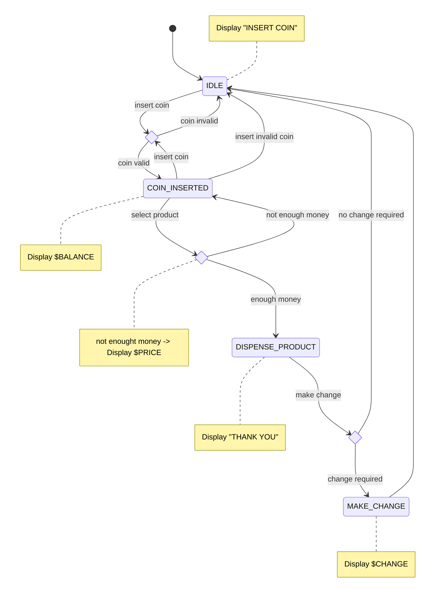

# Vending Machine state diagram

Features : 
- [Accept Coins](https://github.com/guyroyse/vending-machine-kata?tab=readme-ov-file#accept-coins)
- [Select Product](https://github.com/guyroyse/vending-machine-kata?tab=readme-ov-file#select-product)
- [Make Change](https://github.com/guyroyse/vending-machine-kata?tab=readme-ov-file#make-change)

