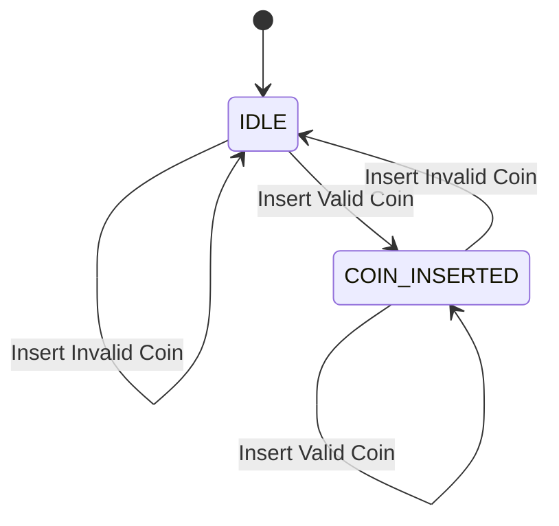

# Vending Machine state diagram

## Feature : [Accept Coins](https://github.com/guyroyse/vending-machine-kata?tab=readme-ov-file#accept-coins)

```mermaid
stateDiagram-v2
    [*] --> IDLE
    IDLE --> COIN_INSERTED : Insert Valid Coin
    IDLE --> IDLE : Insert Invalid Coin
    COIN_INSERTED --> COIN_INSERTED : Insert Valid Coin
    COIN_INSERTED --> IDLE : Insert Invalid Coin

```

## Feature 
